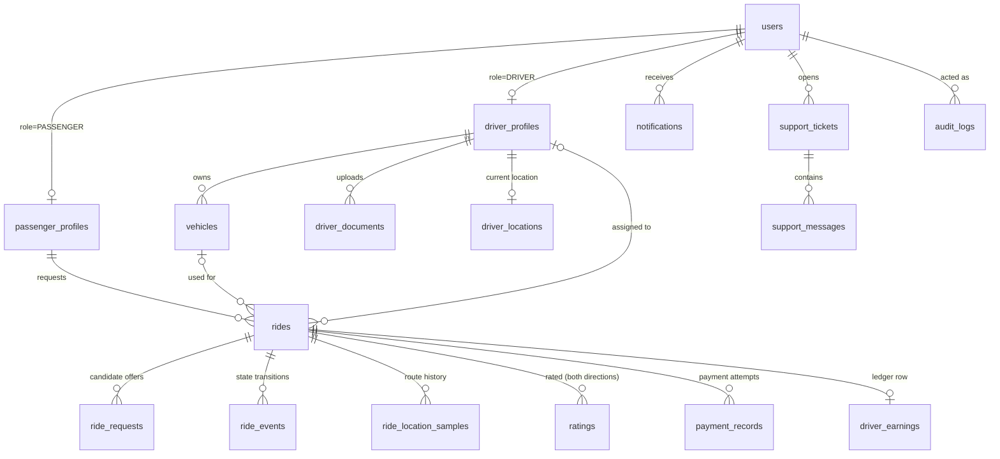

# Database — Phase 1 (Database Foundation)

PostgreSQL schema for the rideshare platform, managed with
[Drizzle ORM](https://orm.drizzle.team) + `drizzle-kit`. Schema lives in
`packages/database/src/schema/*`; generated SQL migrations live in
`packages/database/migrations/`. `apps/api` is the only application with
direct database access (see `docs/architecture.md`).

## Commands

Run from the repo root:

```bash
npm run db:migrate   # apply every migration that hasn't run yet (idempotent)
npm run db:seed      # fill an already-migrated, empty database with fictional dev data
npm run db:reset      # DROP and recreate the schema, then re-run every migration
```

`db:reset` does **not** seed — run `db:seed` afterwards. `db:reset` refuses
to run when `NODE_ENV=production` unless you pass `--force`
(`npm run reset --workspace=packages/database -- --force`). `db:seed`
refuses to run against a non-empty database (run `db:reset` first).

Each command reads `DATABASE_URL` from `packages/database/.env` — copy
`packages/database/.env.example` to get started. These are standalone
scripts (they open their own connection pool); they do not depend on
`apps/api` running.

To change the schema: edit `packages/database/src/schema/*.ts`, then run
`npm run generate --workspace=packages/database` (`drizzle-kit generate`)
to produce a new migration file, review the generated SQL, and commit both
the schema change and the migration together.

## Entity relationships



`promo_codes`, `system_settings`, and `pricing_configs` stand alone (no
inbound FKs yet) — see "Deferred logic" below.

## Table reference

| Table | Purpose | Notable constraints |
| --- | --- | --- |
| `users` | One row per account (any role) | unique lowercase `email`; unique nullable `phone`; `email = lower(email)` CHECK |
| `passenger_profiles` | 1:1 extension of a PASSENGER user | unique `user_id`; cascades on user delete |
| `driver_profiles` | 1:1 extension of a DRIVER user | unique `user_id`, unique `license_number`; **`availability_status` can only be ONLINE/BUSY when `onboarding_status = 'APPROVED'`** (CHECK) |
| `vehicles` | A driver's vehicle(s) | unique `license_plate`/`vin`; **at most one `is_active = true` vehicle per driver** (partial unique index) |
| `driver_documents` | License/registration/insurance/photo uploads | FK to `driver_profiles`; `reviewed_by` FK to `users`, nullable |
| `rides` | The ride record; `status` is the *current* state only | pickup/destination lat/lng CHECKed to valid ranges; money columns CHECKed non-negative; `cancelled_at`/`cancelled_by` must both be null or both be set |
| `ride_requests` | Per-driver offers generated during matching (Phase 8) | many rows can point at one ride (one per candidate tried) |
| `ride_events` | Immutable append-only transition log | previous/new status, actor, optional lat/lng, `metadata` jsonb |
| `driver_locations` | **Latest** known location per driver (upserted) | unique `driver_id` — one row per driver |
| `ride_location_samples` | Historical route breadcrumbs for a ride | many rows per ride |
| `ratings` | Passenger↔driver ratings, one row per direction | unique `(ride_id, direction)`; `stars` CHECKed 1–5 |
| `payment_records` | Payment attempts (Stripe TEST MODE, Phase 11) | unique `idempotency_key`; unique nullable `provider_payment_intent_id`; `amount_cents >= 0` |
| `driver_earnings` | Ledger row per completed ride (section 10) | unique `ride_id`; **`driver_gross_earnings_cents = gross_fare_cents - platform_commission_cents`** (CHECK) |
| `notifications` | In-app notifications | partial index for fast "unread" lookups |
| `support_tickets` / `support_messages` | Support (Phase 18) | ticket optionally linked to a ride; messages support `is_internal_note` |
| `promo_codes` | Table only — see below | unique `code`; discount value CHECKed |
| `audit_logs` | Append-only sensitive-action log | `before`/`after` jsonb snapshots |
| `system_settings` | Admin-editable key/value config | unique `key` |
| `pricing_configs` | Table only — see below | **at most one `active = true` row** (partial unique index) |

All primary keys are `uuid DEFAULT gen_random_uuid()` (native in Postgres
13+, no extension required). Every table has `created_at`; most have
`updated_at` too (append-only tables like `ride_events` and `audit_logs`
only have `created_at` — they're never updated).

## Money

Every monetary column is `integer` cents (section 10 — "$10.25 = 1025
cents", never floating point), e.g. `estimated_fare_cents`,
`gross_fare_cents`, `amount_cents`. `platform_commission_percentage` is the
one exception — it's a percentage (`numeric(5,2)`, 0–100), not a currency
amount.

## Ride status vs. ride history

`rides.status` holds the ride's *current* state. It is **not** the audit
trail — `ride_events` is. Every meaningful transition (in later phases,
enforced by application code, not by this schema alone) should insert a
`ride_events` row recording the previous state, new state, actor, and
timestamp, in addition to updating `rides.status`. The full legal-transition
state machine is Phase 9/12's responsibility; Phase 1 only guarantees that
`status` (and `previous_status`/`new_status` on events) can never hold a
value outside the eleven states in `ride_status` — invalid *values* are
rejected by the enum type; invalid *transitions* are an application-layer
concern.

## Deferred logic (table exists, behavior doesn't yet)

- **`promo_codes`** — section 11 lists this table as part of the core
  domain, but "Promo codes" is explicitly listed under Stage 1's "do not
  implement yet" features. The table is migrated; no application code
  reads, writes, or redeems a promo code.
- **`pricing_configs`** — the table and one seeded `active` row exist so
  something is queryable, but the pricing *engine* (base fare / per-mile /
  per-minute / minimum fare / commission math) is Phase 4.
- **`ride_requests`** — modeled now because it's part of the core schema
  list, but nothing populates it until the matching engine (Phase 8).

## Dev seed data

`npm run db:seed` (via `packages/database/src/seed.ts`, `@faker-js/faker`,
fixed seed `1337` for reproducible output) creates:

- 1 active `pricing_configs` row (placeholder values, not the Phase 4
  pricing engine's real config)
- 10 fictional passengers (`users` + `passenger_profiles`)
- 50 fictional drivers (`users` + `driver_profiles`), distributed across
  onboarding states: 35 `APPROVED`, 6 `PENDING_REVIEW`, 4 `REJECTED`, 3
  `SUSPENDED`, 2 `DRAFT` — plus a matching `driver_documents` row for every
  non-`DRAFT` driver
- 48 vehicles (one per non-`DRAFT` driver)
- 40 sample rides: 25 `COMPLETED` (each with a full `ride_events` trail,
  `ride_location_samples`, a `payment_records` row, a `driver_earnings`
  ledger row, and both-direction `ratings`), 5
  `CANCELLED_BY_PASSENGER`, 3 `CANCELLED_BY_DRIVER`, 3 in an active
  mid-ride state, 4 unmatched (`REQUESTED`/`SEARCHING_DRIVER`)
- `driver_profiles.total_rides` / `average_rating` updated to match the
  rides actually generated, so the aggregate columns are internally
  consistent with the ledger rather than hardcoded

No real personal information is used anywhere in seed data — emails are
`firstname.lastname.roleN@example-dev.test`, and no password hash is set
(Phase 2's registration flow sets a real one; seeded accounts are not
meant to be logged into yet).

## Testing

`packages/database/src/constraints.test.ts` runs against a real Postgres
instance (`rideshare_test`, migrated automatically in `beforeAll`) and
proves — not just declares — that the constraints above are enforced:
duplicate emails, non-lowercase emails, an ONLINE driver that isn't
APPROVED, two active vehicles for one driver, two ratings in the same
direction for one ride, an out-of-range star rating, an unbalanced
earnings ledger row, an out-of-range coordinate, cascade-on-delete for
`passenger_profiles`, and restrict-on-delete for a `driver_profiles` row
still referenced by a `rides` row.
